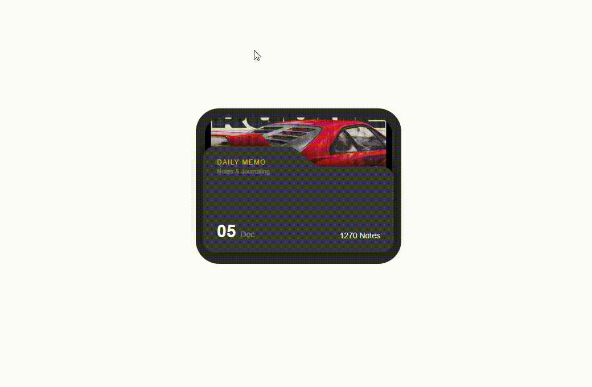

# Animated Folder UI

A smooth, interactive folder card component with a circle-to-folder entrance animation, layered SVG design, and floating hover effect.



---

## Usage

**1. Copy the component into your project**

```bash
/components/Folder.tsx
```

**2. Install dependencies**

```bash
npm install framer-motion
```

**3. Drop it anywhere**

```tsx
import Folder from "@/components/Folder";

export default function Page() {
  return <Folder />;
}
```

---

## Stack


